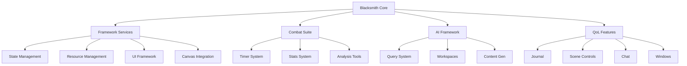
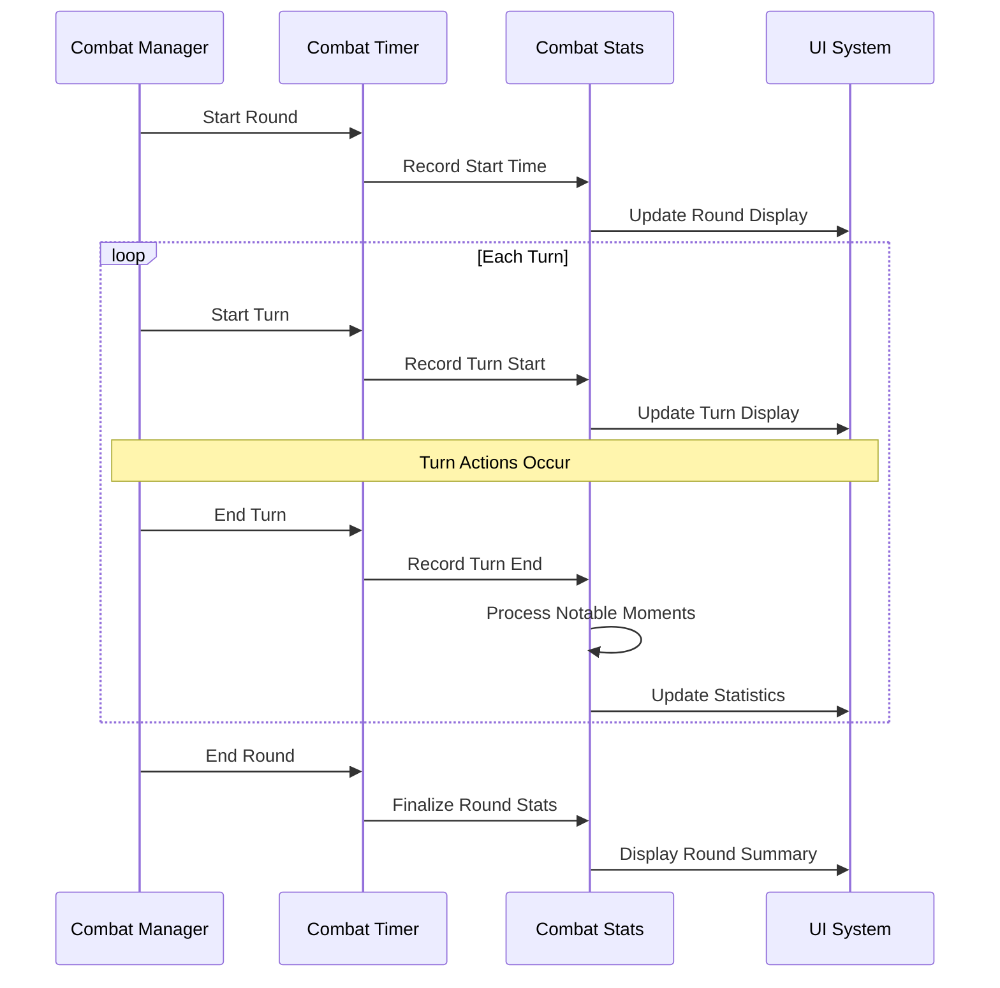
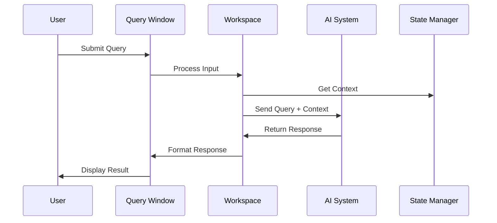
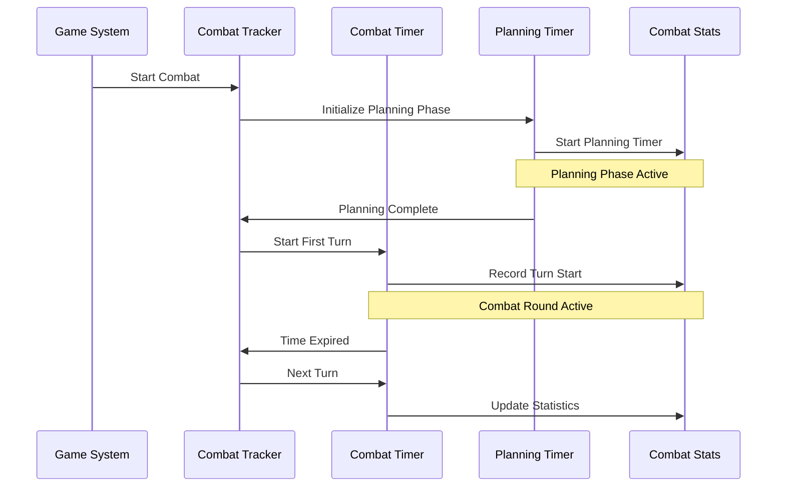
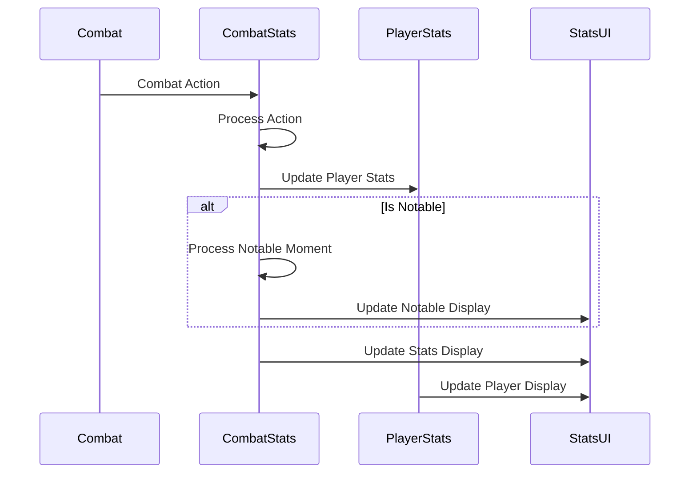
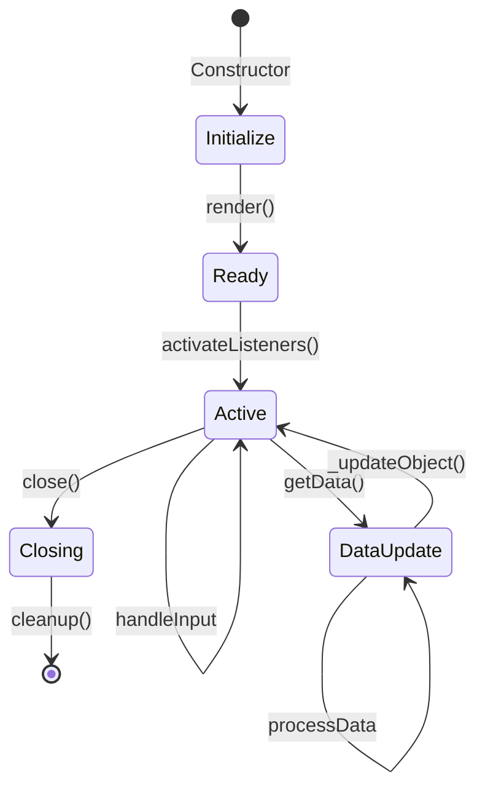

# Coffee Pub Blacksmith - Architecture Documentation

## Overview

Blacksmith serves as the central hub and framework for the Coffee Pub module ecosystem, providing several key service layers:

### 1. Core Framework Services
- **State Management**: Central BLACKSMITH object for cross-module state sharing
- **Resource Management**: Shared CSS, utilities, and assets
- **UI Framework**: Common styling overrides and enhancements
- **Canvas Integration**: Custom layers and token enhancements

### 2. Combat Enhancement Suite
- **Timer Management**: Combat and planning phase timing
- **Statistics Tracking**: Combat and player performance metrics
- **Performance Analysis**: Real-time monitoring and reporting

### 3. AI Integration Framework
- **Workspace System**: Specialized AI interaction spaces
- **GM Tools**: AI-powered game management assistance
- **Content Generation**: Narrative and encounter building

### 4. Quality of Life Enhancements
- **Journal System**: Enhanced journal interactions
- **Scene Controls**: Extended toolbar functionality
- **Chat System**: Enhanced message formatting
- **Window Management**: Improved window styling and controls

## Visual Architecture

### System Components


### Data Flow Examples

#### 1. Combat Round Flow


#### 2. AI Workspace Flow


### Common Implementation Patterns

#### 1. Module Integration
```javascript
// Example of a module integrating with Blacksmith
import { BLACKSMITH } from './const.js';

class MyModule {
    static initialize() {
        // 1. Register with Blacksmith
        BLACKSMITH.registerModule('my-module', {
            name: 'My Module',
            version: '1.0.0'
        });
        
        // 2. Set up state subscriptions
        Hooks.on('blacksmithUpdated', (state) => {
            this._handleStateChange(state);
        });
        
        // 3. Register combat handlers
        BLACKSMITH.combat.registerHandler('turnEnd', this._onTurnEnd.bind(this));
        
        // 4. Create UI elements
        this.window = BLACKSMITH.ui.createWindow({
            template: 'myTemplate.hbs',
            theme: 'modern'
        });
    }
    
    static _handleStateChange(state) {
        // Handle state updates
        if (state.combatActive) {
            this._startCombatMode();
        }
    }
    
    static _onTurnEnd(data) {
        // Process turn end
        this._updateStats(data);
        this.window.render(true);
    }
}
```

#### 2. State Management Pattern
```javascript
// Example of proper state management
class MyFeature {
    constructor() {
        // 1. Initialize local state
        this._state = {
            isActive: false,
            data: null
        };
        
        // 2. Subscribe to global state
        BLACKSMITH.subscribeToKey('combatActive', this._onCombatStateChange.bind(this));
    }
    
    // 3. Update state safely
    setState(newState) {
        this._state = {
            ...this._state,
            ...newState
        };
        
        // 4. Notify global state if needed
        if (this._shouldUpdateGlobal(newState)) {
            BLACKSMITH.updateValue('myFeatureState', this._state);
        }
        
        // 5. Trigger UI update
        this.render();
    }
    
    // 6. Clean up
    destroy() {
        BLACKSMITH.unsubscribeFromKey('combatActive', this._onCombatStateChange);
        this._state = null;
    }
}
```

#### 3. Window Management Pattern
```javascript
// Example of window creation and management
class MyWindow extends BlacksmithWindow {
    // 1. Define defaults
    static get defaultOptions() {
        return mergeObject(super.defaultOptions, {
            template: "templates/my-window.hbs",
            width: 400,
            height: 600,
            resizable: true
        });
    }
    
    // 2. Prepare data
    getData(options) {
        const data = super.getData(options);
        return {
            ...data,
            stats: BLACKSMITH.combat.getStats(),
            settings: this._getSettings()
        };
    }
    
    // 3. Set up listeners
    activateListeners(html) {
        super.activateListeners(html);
        
        // Handle events
        html.find('.action-button').click(this._onAction.bind(this));
        
        // Subscribe to updates
        BLACKSMITH.combat.registerHandler('statsUpdate', this.render.bind(this));
    }
    
    // 4. Clean up
    close() {
        BLACKSMITH.combat.unregisterHandler('statsUpdate', this.render);
        super.close();
    }
}
```

### Error Handling Patterns
```javascript
// Example of comprehensive error handling
class FeatureManager {
    async performOperation() {
        try {
            // 1. Validate inputs
            if (!this._validateInputs()) {
                throw new Error('Invalid inputs');
            }
            
            // 2. Perform operation
            const result = await this._process();
            
            // 3. Update state
            this._updateState(result);
            
        } catch (error) {
            // 4. Log error
            console.error(`${MODULE_ID} | Error in FeatureManager:`, error);
            
            // 5. Notify user
            ui.notifications.error(game.i18n.localize('ERROR.OperationFailed'));
            
            // 6. Attempt recovery
            await this._recoverFromError(error);
            
            // 7. Report if needed
            if (this._shouldReportError(error)) {
                await this._reportError(error);
            }
        }
    }
    
    _shouldReportError(error) {
        return error.critical || error.unrecoverable;
    }
}
```

## Getting Started

### Initialization Flow
```javascript
// 1. Module Registration
Hooks.once('init', () => {
    // Register module settings
    // Initialize canvas layers
    // Register core hooks
});

// 2. Setup Phase
Hooks.once('setup', () => {
    // Register templates
    // Initialize BLACKSMITH object
    // Setup global utilities
});

// 3. Ready Phase
Hooks.once('ready', () => {
    // Initialize combat systems
    // Setup AI framework
    // Apply UI enhancements
});
```

### Configuration Guide

#### 1. Core Configuration (`const.js`)
```javascript
export const BLACKSMITH = {
    // Module identification
    MODULE_ID: 'coffee-pub-blacksmith',
    
    // Template paths
    TEMPLATES: {
        WINDOW_QUERY: 'templates/window-query.hbs',
    },
    
    // Debug settings
    DEBUG: {
        enabled: false,
        verboseLogging: false
    }
}
```

#### 2. Runtime Settings (`settings.js`)
- Game system configuration
- Timer durations
- UI preferences
- Sound settings
- Theme management

#### 3. System Defaults
Each major system maintains its own defaults:
```javascript
static DEFAULTS = {
    // Combat Timer defaults
    COMBAT_TIMER: {
        duration: 60,
        autoStart: false
    },
    
    // Window system defaults
    WINDOWS: {
        defaultTheme: 'modern',
        persistState: true
    }
}
```

### Integration Guide

#### 1. For Coffee Pub Modules
```javascript
// Access shared state
import { BLACKSMITH } from 'coffee-pub-blacksmith';

// Use shared utilities
import { postConsoleAndNotification } from './global.js';

// Access shared CSS
// Include in module.json:
"styles": ["styles/coffee-pub-shared.css"]
```

#### 2. Hook Registration
```javascript
// Register for state updates
Hooks.on('blacksmithUpdated', (state) => {
    // Handle state changes
});

// Register for combat events
Hooks.on('blacksmithCombatUpdate', (data) => {
    // Handle combat updates
});
```

## Core Systems

### 1. Framework Services

#### State Management System
The BLACKSMITH object serves as a central state store:
```javascript
BLACKSMITH = {
    // State update method
    updateValue(key, value) {
        this[key] = value;
        Hooks.callAll("blacksmithUpdated", this);
    },
    
    // State retrieval
    getValue(key) {
        return this[key];
    }
}
```

#### Canvas Enhancement System
```javascript
// Custom layer registration
Hooks.on('canvasInit', () => {
    const layer = new BlacksmithLayer();
    canvas.blacksmith = layer;
});

// Token customization
Hooks.on('createToken', (token) => {
    // Apply custom styling
    // Add enhanced nameplates
});
```

#### UI Override System
- Window styling management
- Chat message formatting
- Scene control enhancements
- Journal interaction improvements

#### Shared Resource Management
- CSS framework
- Utility functions
- Asset management
- Theme system

### 2. Combat Management

#### Timer System
The combat management system uses two coordinated timers:

1. **Combat Timer** (`scripts/combat-timer.js`)
   ```javascript
   class CombatTimer {
       static DEFAULTS = {
           timeLimit: 60,
           state: {
               isActive: boolean,
               isPaused: boolean,
               remaining: number
           }
       }
       
       // Core timer functionality
       static initialize()
       static startTimer(duration)
       static pauseTimer()
       static resumeTimer()
   }
   ```

2. **Planning Timer** (`scripts/planning-timer.js`)
   ```javascript
   class PlanningTimer {
       // Pre-round planning phase management
       static handleCombatStart()
       static handleNewRound()
       static handleTurnChange()
   }
   ```

#### Statistics System
Tracks both combat-level and player-level statistics:

1. **Combat Statistics** (`scripts/combat-stats.js`)
   ```javascript
   class CombatStats {
       // Combat-level tracking
       static recordTurnStart/End()
       static recordPlanningPhase()
       static processNotableMoment()
       
       // Performance metrics
       static calculateMVP()
       static generateRoundSummary()
   }
   ```

2. **Player Statistics** (`scripts/player-stats.js`)
   ```javascript
   class CPBPlayerStats {
       // Lifetime stat tracking
       static initializeActorStats()
       static updatePlayerStats()
       
       // Combat event handling
       static _onAttackRoll()
       static _onDamageRoll()
       static _processTurnStart/End()
   }
   ```

### 3. AI Assistant Framework

#### Query System (`scripts/window-query.js`)
Manages AI interactions through specialized workspaces:

1. **Workspace Types**
   - **Narrative**: Story and scene development
   - **Encounter**: Combat encounter building
   - **Assistant**: General GM assistance
   - **Lookup**: Rules and reference queries
   - **Character**: Character development tools

2. **Template Management**
   ```javascript
   // Template registration
   registerPartialsAndRender = async () => {
       // Workspace templates
       await registerWorkspaceTemplates()
       // Global elements
       await registerGlobalElements()
       // Specialized components
       await registerComponents()
   }
   ```

3. **Data Processing**
   ```javascript
   class BlacksmithWindowQuery {
       // Form handling
       _onSubmit(event, form)
       
       // Data management
       getData(options)
       
       // Event handling
       activateListeners(html)
   }
   ```

### 4. UI Framework

#### Toolbar System (`scripts/toolbar.js`)
Provides access to module features:

```javascript
export function addToolbarButton() {
    Hooks.on('getSceneControlButtons', (controls) => {
        controls.push({
            name: "blacksmith-utilities",
            title: "Blacksmith Utilities",
            tools: [
                // Core tools
                regentTool,
                // Workspace tools
                lookupTool,
                characterTool,
                assistantTool,
                encounterTool,
                narrativeTool
            ]
        });
    });
}
```

#### Window Management
1. **Window Base Class**
   ```javascript
   class BlacksmithWindow extends Application {
       // Window lifecycle
       constructor(options)
       render(force)
       close()
       
       // State management
       getData()
       activateListeners()
   }
   ```

2. **Specialized Windows**
   - Query window
   - Combat summary window

#### Template System
1. **Core Templates**
   - Window frameworks
   - Form components
   - Status displays
   - Message formatting

2. **Workspace Templates**
   - Specialized workspace layouts
   - Tool-specific components
   - Dynamic content areas

3. **Style Management**
   ```javascript
   // Theme registration
   function registerThemes() {
       // Register available themes
       // Configure default styles
       // Set up theme switching
   }
   ```

### 5. Development Patterns

#### State Management
1. **Central State**
   ```javascript
   // State updates
   BLACKSMITH.updateValue('key', value);
   
   // State subscriptions
   Hooks.on('blacksmithUpdated', (state) => {
       // Handle state changes
   });
   ```

2. **Local State**
   - Component-level state management
   - Form state handling
   - Window state persistence

#### Event Flow
1. **Combat Events**
   ```mermaid
   sequenceDiagram
       Combat->>Timer: Start Round
       Timer->>Stats: Record Start
       Stats->>UI: Update Display
   ```

2. **AI Interactions**
   ```mermaid
   sequenceDiagram
       UI->>Query: Submit Request
       Query->>AI: Process Query
       AI->>UI: Return Response
   ```

#### Error Handling
```javascript
try {
    // Operation
} catch (error) {
    // Log error
    console.error(`${MODULE_ID} | Error:`, error);
    // Notify user
    ui.notifications.error("Operation failed");
    // Graceful fallback
    handleFailure();
}
```

### 6. Performance Considerations

#### Resource Management
1. **Asset Loading**
   ```javascript
   // Lazy loading of templates and assets
   async function loadTemplate(path) {
       if (!templateCache[path]) {
           templateCache[path] = await fetchTemplate(path);
       }
       return templateCache[path];
   }
   ```

2. **State Optimization**
   - Debounced state updates
   - Selective hook firing
   - Cached computations

#### Memory Management
1. **Window Cleanup**
   ```javascript
   class BlacksmithWindow extends Application {
       close() {
           // Clear references
           this._clearSubscriptions();
           // Remove DOM elements
           this.element.remove();
           // Clear cache
           this._clearCache();
       }
   }
   ```

2. **Combat Cleanup**
   ```javascript
   class CombatStats {
       static _onCombatEnd() {
           // Archive stats
           this._archiveStats();
           // Clear current stats
           this._resetCurrentStats();
           // Clean up subscriptions
           this._clearSubscriptions();
       }
   }
   ```

### 7. Testing and Debugging

#### Debug Mode
```javascript
// Enable debug mode
game.settings.set('coffee-pub-blacksmith', 'debugMode', true);

// Debug logging
function log(message, data = null) {
    if (BLACKSMITH.DEBUG.enabled) {
        console.log(`${MODULE_ID} | ${message}`, data);
    }
}
```

#### Performance Monitoring
```javascript
class PerformanceMonitor {
    static startTrace(label) {
        if (!BLACKSMITH.DEBUG.enabled) return;
        console.time(label);
    }
    
    static endTrace(label) {
        if (!BLACKSMITH.DEBUG.enabled) return;
        console.timeEnd(label);
    }
}
```

#### State Inspection
```javascript
// State debugging helpers
BLACKSMITH.debug = {
    // Dump current state
    dumpState() {
        console.table(this._state);
    },
    
    // Track state changes
    trackKey(key) {
        this._watchedKeys.add(key);
    }
}
```

### 8. Future Development

#### Planned Features
1. **Enhanced Combat Analysis**
   - Advanced statistics tracking
   - Performance trend analysis
   - Combat replay system

2. **Extended AI Integration**
   - Natural language processing improvements
   - Context-aware responses
   - Advanced content generation

3. **UI/UX Enhancements**
   - Customizable layouts
   - Advanced theming system
   - Responsive design improvements

#### Module API
Future versions will expose a comprehensive API for other modules:

```javascript
// Public API example
class BlacksmithAPI {
    // State Management
    static getState(key)
    static setState(key, value)
    
    // Combat Interface
    static getCombatStats()
    static registerCombatHandler(callback)
    
    // UI Management
    static createWindow(options)
    static registerTool(toolData)
    
    // AI Integration
    static queryAI(prompt, context)
    static registerWorkspace(config)
}
```

### 9. API Documentation

#### State Management API
```javascript
/**
 * Updates a value in the central state store
 * @param {string} key - The state key to update
 * @param {any} value - The new value
 * @fires blacksmithUpdated
 */
BLACKSMITH.updateValue(key, value)

/**
 * Retrieves a value from the central state store
 * @param {string} key - The state key to retrieve
 * @returns {any} The stored value
 */
BLACKSMITH.getValue(key)
```

#### Combat System API
```javascript
/**
 * Registers a combat event handler
 * @param {string} event - The event type to handle
 * @param {Function} callback - The handler function
 * @returns {string} Handler ID for cleanup
 */
BLACKSMITH.combat.registerHandler(event, callback)

/**
 * Retrieves current combat statistics
 * @returns {Object} Current combat stats
 */
BLACKSMITH.combat.getStats()
```

#### UI System API
```javascript
/**
 * Creates a new window using the Blacksmith framework
 * @param {Object} options - Window configuration
 * @returns {BlacksmithWindow} The created window instance
 */
BLACKSMITH.ui.createWindow(options)

/**
 * Registers a new toolbar tool
 * @param {Object} toolData - Tool configuration
 * @returns {boolean} Success status
 */
BLACKSMITH.ui.registerTool(toolData)
```

#### AI Integration API
```javascript
/**
 * Sends a query to the AI system
 * @param {string} prompt - The query text
 * @param {Object} context - Additional context
 * @returns {Promise<Object>} AI response
 */
BLACKSMITH.ai.query(prompt, context)

/**
 * Registers a new AI workspace
 * @param {Object} config - Workspace configuration
 * @returns {string} Workspace ID
 */
BLACKSMITH.ai.registerWorkspace(config)
```

### Additional Implementation Examples

#### 1. Timer System Integration


#### 2. Notable Moments System
```javascript
// Example of processing and recording notable moments
class NotableMomentsManager {
    constructor() {
        // Register for relevant hooks
        Hooks.on('dnd5e.rollAttack', this._processAttackRoll.bind(this));
        Hooks.on('dnd5e.rollDamage', this._processDamageRoll.bind(this));
        Hooks.on('dnd5e.rollSave', this._processSaveRoll.bind(this));
    }
    
    _processAttackRoll(actor, roll) {
        // Check for critical hits/misses
        if (roll.dice[0].total === 20) {
            this._recordNotableMoment({
                type: 'CRITICAL_HIT',
                actor: actor.name,
                roll: roll.total
            });
        }
    }
    
    _recordNotableMoment(moment) {
        BLACKSMITH.combat.recordNotableMoment({
            timestamp: game.time.worldTime,
            type: moment.type,
            actor: moment.actor,
            details: moment
        });
    }
}
```

#### 3. Stats Processing Flow


#### 4. Window System Lifecycle


#### 5. Template Rendering System
```javascript
class TemplateManager {
    constructor() {
        this.templateCache = new Map();
        this.partialCache = new Map();
    }
    
    async loadTemplates() {
        // Load all required templates
        const templatePaths = {
            windowBase: 'templates/window-base.hbs',
            statCard: 'templates/components/stat-card.hbs',
            notableMoment: 'templates/components/notable-moment.hbs'
        };
        
        // Load and cache templates
        for (const [key, path] of Object.entries(templatePaths)) {
            if (!this.templateCache.has(path)) {
                const template = await fetchTemplate(path);
                this.templateCache.set(path, template);
                
                // Register partial if it's a component
                if (path.includes('components/')) {
                    const name = path.split('/').pop().replace('.hbs', '');
                    Handlebars.registerPartial(name, template);
                }
            }
        }
    }
    
    async renderTemplate(path, data) {
        // Get template from cache
        const template = this.templateCache.get(path);
        if (!template) {
            throw new Error(`Template not found: ${path}`);
        }
        
        // Process data
        const processedData = this._processTemplateData(data);
        
        // Render with helpers
        return Handlebars.compile(template)(processedData);
    }
    
    _processTemplateData(data) {
        return {
            ...data,
            isGM: game.user.isGM,
            settings: BLACKSMITH.settings,
            i18n: (key) => game.i18n.localize(key)
        };
    }
}
```

#### 6. Event Handling System
```javascript
class EventManager {
    constructor() {
        this.handlers = new Map();
        this.subscriptions = new Set();
    }
    
    // Register event handlers
    registerHandler(event, handler, context = null) {
        const id = this._generateHandlerId();
        this.handlers.set(id, {
            event,
            handler: context ? handler.bind(context) : handler
        });
        
        // Track for cleanup
        if (context) {
            if (!this.subscriptions.has(context)) {
                this.subscriptions.add(context);
            }
        }
        
        return id;
    }
    
    // Handle cleanup
    cleanupContext(context) {
        if (this.subscriptions.has(context)) {
            // Find all handlers for this context
            for (const [id, data] of this.handlers.entries()) {
                if (data.context === context) {
                    this.handlers.delete(id);
                }
            }
            this.subscriptions.delete(context);
        }
    }
    
    // Emit events
    emit(event, data) {
        for (const [id, handlerData] of this.handlers.entries()) {
            if (handlerData.event === event) {
                try {
                    handlerData.handler(data);
                } catch (error) {
                    console.error(`${MODULE_ID} | Error in event handler:`, error);
                }
            }
        }
    }
}
```

#### 7. State Synchronization Pattern
```javascript
class StateSyncManager {
    constructor() {
        this.state = {};
        this.syncQueue = new Map();
        this.lastSync = Date.now();
    }
    
    // Queue state updates
    queueUpdate(key, value) {
        this.syncQueue.set(key, value);
        this._scheduleSyncIfNeeded();
    }
    
    // Process queued updates
    async _processQueue() {
        if (this.syncQueue.size === 0) return;
        
        const updates = Object.fromEntries(this.syncQueue);
        this.syncQueue.clear();
        
        try {
            // Update local state
            Object.assign(this.state, updates);
            
            // Sync with other clients
            await game.socket.emit(`module.${MODULE_ID}`, {
                type: 'stateSync',
                updates
            });
            
            // Notify subscribers
            this._notifySubscribers(updates);
            
        } catch (error) {
            console.error(`${MODULE_ID} | State sync failed:`, error);
            // Requeue failed updates
            for (const [key, value] of Object.entries(updates)) {
                this.syncQueue.set(key, value);
            }
        }
    }
    
    // Handle incoming sync
    handleRemoteSync(updates) {
        // Update local state
        Object.assign(this.state, updates);
        
        // Notify subscribers
        this._notifySubscribers(updates);
    }
}
```

### Quick Start Guide

#### 1. Adding a New Feature
```javascript
// Example: Adding a new combat analysis feature
class DamageAnalyzer {
    static initialize() {
        // 1. Register with Blacksmith
        BLACKSMITH.registerModule('damage-analyzer', {
            name: 'Damage Analyzer',
            version: '1.0.0'
        });

        // 2. Set up combat hooks
        BLACKSMITH.combat.registerHandler('damageDealt', this._onDamageDealt.bind(this));
        
        // 3. Create UI
        this.window = BLACKSMITH.ui.createWindow({
            template: 'modules/damage-analyzer/templates/analyzer.hbs',
            title: 'Damage Analysis'
        });
        
        // 4. Add toolbar button
        BLACKSMITH.ui.registerTool({
            name: 'damage-analyzer',
            title: 'Damage Analysis',
            icon: 'fas fa-chart-bar',
            onClick: () => this.window.render(true)
        });
    }
}
```

#### 2. Common Use Cases

##### Combat Event Processing
```javascript
// Register for specific combat events
BLACKSMITH.combat.registerHandler('turnStart', (data) => {
    // Access current combat state
    const combat = game.combat;
    const currentActor = combat.combatant.actor;
    
    // Access combat statistics
    const stats = BLACKSMITH.combat.getStats();
    const turnCount = stats.currentRound.turns.length;
    
    // Update UI
    BLACKSMITH.ui.updateDisplay({
        actor: currentActor,
        stats: stats,
        turn: turnCount
    });
});
```

##### State Management
```javascript
// Manage feature state
class FeatureState {
    constructor() {
        // Initialize with defaults
        this.state = BLACKSMITH.getValue('myFeature') || {
            isActive: false,
            data: null
        };
        
        // Subscribe to changes
        BLACKSMITH.subscribeToKey('combatActive', (isActive) => {
            this.state.isActive = isActive;
            this._onStateChange();
        });
    }
    
    _onStateChange() {
        // Update UI
        this._updateDisplay();
        
        // Notify other systems
        Hooks.callAll('myFeatureStateChanged', this.state);
    }
}
```

##### Window Creation
```javascript
class AnalysisWindow extends BlacksmithWindow {
    static get defaultOptions() {
        return mergeObject(super.defaultOptions, {
            template: "templates/analysis.hbs",
            width: 400,
            height: 600,
            title: "Combat Analysis"
        });
    }
    
    getData() {
        // Get combat stats
        const stats = BLACKSMITH.combat.getStats();
        
        // Process for display
        return {
            rounds: stats.rounds,
            currentRound: stats.currentRound,
            notable: stats.notableMoments,
            summary: this._generateSummary(stats)
        };
    }
}
```

### Troubleshooting Guide

#### Common Issues

1. **State Synchronization Issues**
```javascript
// Problem: State updates not reflecting across clients
// Solution: Use the StateSyncManager

// Instead of:
BLACKSMITH.state.myValue = newValue;

// Do this:
BLACKSMITH.syncManager.queueUpdate('myValue', newValue);
```

2. **Memory Leaks**
```javascript
// Problem: Event handlers not being cleaned up
// Solution: Use the cleanup pattern

class MyFeature {
    constructor() {
        this._boundHandlers = new Map();
    }
    
    activate() {
        // Store reference to bound handler
        const handler = this._onCombatUpdate.bind(this);
        this._boundHandlers.set('combatUpdate', handler);
        
        // Register handler
        BLACKSMITH.combat.registerHandler('update', handler);
    }
    
    destroy() {
        // Clean up all handlers
        for (const [event, handler] of this._boundHandlers) {
            BLACKSMITH.combat.unregisterHandler(event, handler);
        }
        this._boundHandlers.clear();
    }
}
```

3. **Performance Issues**
```javascript
// Problem: Frequent state updates causing performance issues
// Solution: Use debouncing

class PerformantFeature {
    constructor() {
        this._updateDebounced = foundry.utils.debounce(
            this._update.bind(this),
            250
        );
    }
    
    handleFrequentUpdates(data) {
        // This will only trigger once every 250ms
        this._updateDebounced(data);
    }
}
```

### AI Integration Examples

#### 1. Creating a Custom AI Workspace
```javascript
class CustomWorkspace extends BlacksmithWorkspace {
    static get defaultOptions() {
        return mergeObject(super.defaultOptions, {
            template: "templates/custom-workspace.hbs",
            title: "Custom AI Assistant"
        });
    }
    
    // Define context providers
    getContext() {
        return {
            // Current game state
            combat: game.combat ? {
                round: game.combat.round,
                turn: game.combat.turn
            } : null,
            
            // Scene information
            scene: canvas.scene ? {
                name: canvas.scene.name,
                darkness: canvas.scene.darkness
            } : null,
            
            // Custom context
            customData: this._getCustomContext()
        };
    }
    
    // Handle AI responses
    async _processAIResponse(response) {
        // Parse AI response
        const { actions, suggestions } = response;
        
        // Apply any automatic actions
        if (actions) {
            await this._executeActions(actions);
        }
        
        // Update UI with suggestions
        this._updateSuggestions(suggestions);
    }
}
```

#### 2. AI Query Handling
```javascript
class AIQueryManager {
    async submitQuery(query, context) {
        try {
            // Add standard context
            const enrichedContext = this._enrichContext(context);
            
            // Submit to AI
            const response = await BLACKSMITH.ai.query(query, enrichedContext);
            
            // Process response
            await this._handleResponse(response);
            
        } catch (error) {
            console.error(`${MODULE_ID} | AI Query Error:`, error);
            ui.notifications.error("AI query failed. Check console for details.");
        }
    }
    
    _enrichContext(context) {
        return {
            ...context,
            system: {
                version: game.version,
                module: game.modules.get(MODULE_ID).version
            },
            user: {
                isGM: game.user.isGM,
                permissions: game.user.permissions
            }
        };
    }
}
```

#### 3. AI Response Processing
```javascript
class AIResponseProcessor {
    constructor() {
        this.actionHandlers = new Map();
        this._registerDefaultHandlers();
    }
    
    _registerDefaultHandlers() {
        // Register handlers for common AI actions
        this.actionHandlers.set('createJournalEntry', this._handleJournalCreation);
        this.actionHandlers.set('updateScene', this._handleSceneUpdate);
        this.actionHandlers.set('sendMessage', this._handleMessageSend);
    }
    
    async processResponse(response) {
        const { actions, data } = response;
        
        // Process each action
        for (const action of actions) {
            const handler = this.actionHandlers.get(action.type);
            if (handler) {
                await handler(action.data);
            }
        }
        
        // Update UI
        this._updateUI(data);
    }
    
    // Example action handler
    async _handleJournalCreation(data) {
        const entry = await JournalEntry.create({
            name: data.title,
            content: data.content,
            folder: data.folderId
        });
        
        return entry;
    }
}
```

These examples provide practical implementations and solutions for common development scenarios. Would you like me to add any other specific examples or expand on any of these sections?

### Best Practices Guide

#### 1. Module Organization
```javascript
// Recommended file structure
modules/
  your-module/
    scripts/
      main.js         // Entry point
      features/       // Feature implementations
      windows/        // Window definitions
      helpers/        // Utility functions
    templates/        // Handlebars templates
    styles/          // CSS files
    lang/            // Localization files
```

#### 2. State Management Patterns
```javascript
// Centralized state management
class ModuleState {
    constructor() {
        // Register with Blacksmith
        BLACKSMITH.registerState('myModule', {
            // Define initial state
            state: {
                features: new Map(),
                settings: new Map(),
                cache: new WeakMap()
            },
            // Define handlers
            handlers: {
                onStateChange: this._handleStateChange.bind(this),
                onCombatUpdate: this._handleCombatUpdate.bind(this)
            }
        });
    }

    // Use getters for derived state
    get activeFeatures() {
        return Array.from(this.state.features.values())
            .filter(f => f.isActive);
    }

    // Batch updates for performance
    batchUpdate(updates) {
        const batch = new Map(updates);
        BLACKSMITH.syncManager.queueBatchUpdate('myModule', batch);
    }
}
```

#### 3. Event Handling Best Practices
```javascript
// Centralized event management
class EventManager {
    constructor() {
        this.handlers = new Map();
        this._setupEventCleanup();
    }

    // Register multiple handlers at once
    registerHandlers(handlers) {
        for (const [event, handler] of Object.entries(handlers)) {
            this.registerHandler(event, handler);
        }
    }

    // Automatic cleanup on module disable
    _setupEventCleanup() {
        Hooks.once('disable', () => {
            this.handlers.forEach((handler, event) => {
                BLACKSMITH.unregisterHandler(event, handler);
            });
            this.handlers.clear();
        });
    }
}
```

### Module Communication Examples

#### 1. Inter-Module Communication
```javascript
// Publishing events
class ModuleA {
    notifyChange(data) {
        // Emit event for other modules
        Hooks.callAll('myModule.stateChanged', {
            source: 'moduleA',
            data: data
        });
    }
}

// Subscribing to events
class ModuleB {
    initialize() {
        // Listen for events from other modules
        Hooks.on('myModule.stateChanged', this._handleExternalChange.bind(this));
    }

    _handleExternalChange(event) {
        if (event.source !== 'moduleB') {
            this._processExternalUpdate(event.data);
        }
    }
}
```

#### 2. Shared Resource Management
```javascript
// Sharing resources between modules
class ResourceManager {
    constructor() {
        this.sharedResources = BLACKSMITH.getSharedResources('myModule');
    }

    // Register shared components
    registerSharedComponents() {
        BLACKSMITH.registerComponent('myCustomCard', {
            template: 'templates/custom-card.hbs',
            styles: 'styles/custom-card.css',
            hooks: {
                onCreate: this._onCardCreate.bind(this),
                onUpdate: this._onCardUpdate.bind(this)
            }
        });
    }

    // Access shared resources
    async useSharedResource(resourceId) {
        const resource = await this.sharedResources.get(resourceId);
        if (resource) {
            return this._processResource(resource);
        }
    }
}
```

### Template Examples

#### 1. Window Templates
```handlebars
{{!-- templates/analysis-window.hbs --}}
<div class="analysis-window">
    <header class="window-header">
        <h1>{{localize "ANALYSIS.Title"}}</h1>
        {{#if hasData}}
            <div class="header-buttons">
                <button class="export-btn">
                    <i class="fas fa-download"></i>
                    {{localize "ANALYSIS.Export"}}
                </button>
            </div>
        {{/if}}
    </header>

    <section class="window-content">
        {{#if isLoading}}
            {{> "modules/blacksmith/templates/parts/loading.hbs"}}
        {{else}}
            <div class="stats-container">
                {{#each stats}}
                    {{> "modules/blacksmith/templates/parts/stat-card.hbs" this}}
                {{/each}}
            </div>
        {{/if}}
    </section>
</div>
```

#### 2. Component Templates
```handlebars
{{!-- templates/parts/stat-card.hbs --}}
<div class="stat-card" data-stat-id="{{id}}">
    <div class="card-header">
        <h3>{{name}}</h3>
        {{#if canEdit}}
            <div class="card-controls">
                <a class="edit-stat"><i class="fas fa-edit"></i></a>
                <a class="delete-stat"><i class="fas fa-trash"></i></a>
            </div>
        {{/if}}
    </div>

    <div class="card-content">
        {{#if hasIcon}}
            
        {{/if}}
        
        <div class="stat-values">
            {{#each values}}
                <div class="stat-value">
                    <label>{{label}}</label>
                    <span class="value {{cssClass}}">{{value}}</span>
                </div>
            {{/each}}
        </div>
    </div>

    {{#if hasFooter}}
        <div class="card-footer">
            {{#each actions}}
                <button class="{{cssClass}}" data-action="{{action}}">
                    {{label}}
                </button>
            {{/each}}
        </div>
    {{/if}}
</div>
```

#### 3. Form Templates
```handlebars
{{!-- templates/parts/settings-form.hbs --}}
<form class="settings-form">
    <div class="form-group">
        <label for="timerDuration">
            {{localize "SETTINGS.TimerDuration"}}
            <span class="hint">{{localize "SETTINGS.TimerDurationHint"}}</span>
        </label>
        <div class="form-fields">
            <input type="number" 
                   name="timerDuration" 
                   value="{{settings.timerDuration}}"
                   min="30"
                   max="300"
                   step="30">
            <span class="units">{{localize "TIME.Seconds"}}</span>
        </div>
    </div>

    <div class="form-group">
        <label for="theme">{{localize "SETTINGS.Theme"}}</label>
        <div class="form-fields">
            <select name="theme">
                {{#select settings.theme}}
                    {{#each availableThemes}}
                        <option value="{{this.id}}">{{this.name}}</option>
                    {{/each}}
                {{/select}}
            </select>
        </div>
    </div>

    <div class="form-group">
        <label class="checkbox">
            <input type="checkbox" 
                   name="enableNotifications" 
                   {{checked settings.enableNotifications}}>
            {{localize "SETTINGS.EnableNotifications"}}
        </label>
    </div>

    <footer class="form-footer">
        <button type="submit" name="submit">
            <i class="fas fa-save"></i>
            {{localize "SETTINGS.Save"}}
        </button>
    </footer>
</form>
```

These examples provide practical templates and patterns that developers can use as starting points for their own implementations. The templates include common UI patterns, form structures, and component layouts that follow Foundry VTT's styling conventions while integrating with Blacksmith's features.
