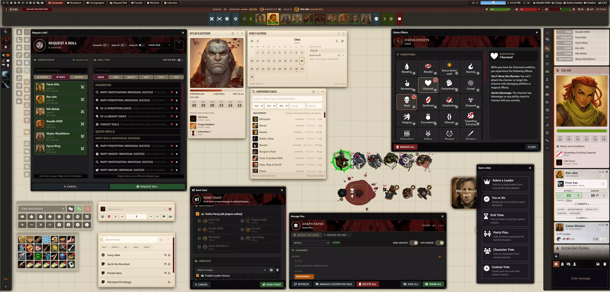

# Coffee Pub Blacksmith


> **v12 notice:** Version 12.1.23 is the final build compatible with FoundryVTT v12. All subsequent releases target v13+.

## Overview

Blacksmith is the foundational framework for the entire Coffee Pub module series. It provides the shared design system, window base classes, APIs, and cross-client communication layer that all other Coffee Pub modules depend on. It is also a capable standalone module with GM tools, combat statistics, and UI customization features.



## Disclaimer

This is a personal project built for my own FoundryVTT games. If you find it useful, feel free to use it — but it comes with no guarantees of stability, compatibility, or support. **Use at your own risk.**

## Features

### GM Tools
- **CSS Editor**: Live custom CSS editor with CodeMirror 6 syntax highlighting, line numbers, and search/replace (Ctrl+F / Ctrl+H)
- **Voting System**: Create and broadcast votes to players with real-time results
- **Pin Layers**: Manage canvas pin visibility by layer with per-layer eye toggles

### Combat & Statistics
- **Combat Timers**: Synchronized turn countdowns across all clients, with pause/resume and auto-start on movement or attacks
- **Planning Timer**: Dedicated pre-combat timing tool
- **Party Statistics**: Detailed combat history, leaderboards, and per-player performance tracking
- **Player Statistics**: Individual breakdown of hits, misses, damage, healing, kills, crits, and MVP scores
- **Enhanced Combat Tracker**: Drag-and-drop initiative, health bars, portrait display

### UI & Theming
- **Design System**: Shared CSS tokens, component library, and window base classes used across all Coffee Pub modules
- **Theme Support**: Multiple visual themes with persistent settings; drives theme selection for all Coffee Pub modules
- **Chat Cards**: Enhanced roll result layout with improved success/failure indicators and tooltips

### Movement Controls
- **Movement Modes**: Normal, No movement, Combat, Follow, and Conga line modes
- **GM Controls**: Visual mode indicators, persistent settings, quick-access toolbar buttons

### Quality of Life
- **Token Management**: Smart renaming, customizable nameplates, fuzzy name matching
- **Scene Management**: Custom mouse behaviors, configurable scene indicators
- **Network Stats**: Real-time latency display with color-coded indicators for all players

### Developer API
- **Module Registration**: Standardized integration point for other Coffee Pub modules
- **Socket Layer**: Cross-client messaging via SocketLib with native fallback
- **Statistics API**: Public interface for reading and writing combat stats
- **Window Base (V2)**: `BlacksmithWindowBaseV2` — ApplicationV2-based window class used by all windows in the suite

## Requirements

- **FoundryVTT**: v13+
- **Game System**: D&D 5e (fully supported)
- **[socketlib](https://github.com/manuelVo/foundryvtt-socketlib)**: Required for cross-client sync

## Installation

1. Install **socketlib** first:
   - Foundry Admin → Install Module → paste manifest URL:
   `https://github.com/farling42/foundryvtt-socketlib/releases/latest/download/module.json`

2. Install **Coffee Pub Blacksmith**:
   - Foundry Admin → Install Module → paste manifest URL:
   `https://github.com/Drowbe/coffee-pub-blacksmith/releases/latest/download/module.json`

3. Enable both modules in your world.

## Coffee Pub Module Suite

Blacksmith is the foundation every other Coffee Pub module is built on. Each one is optional and
installed separately.

| Module | What it adds |
|---|---|
| [Artificer](https://github.com/Drowbe/coffee-pub-artificer) | A crafting, recipe, and blueprint system. |
| [Bibliosoph](https://github.com/Drowbe/coffee-pub-bibliosoph) | In-game player messaging backed by journals, plus injuries, quick encounter building, inspiration, and critical hit announcements. |
| [Cartographer](https://github.com/Drowbe/coffee-pub-cartographer) | Party strategic planning and sketching. |
| [Crier](https://github.com/Drowbe/coffee-pub-crier) | Combat turn announcements with turn cards, round announcements, and status tracking. |
| [Curator](https://github.com/Drowbe/coffee-pub-curator) | Image management: token replacement, portrait replacement, and tile and map placement. |
| [Herald](https://github.com/Drowbe/coffee-pub-herald) | Streaming and broadcast view. Designate a cameraman user for a clean, UI-free view that follows tokens. |
| [Librarian](https://github.com/Drowbe/coffee-pub-librarian) | A codex of people, places, factions and artifacts, and the quests running through them, linked to the canvas. |
| [Merchant](https://github.com/Drowbe/coffee-pub-merchant) | Shops and merchants: mark an actor as a merchant and let players browse and buy from their stock. |
| [Minstrel](https://github.com/Drowbe/coffee-pub-minstrel) | A music, environment, and one-shot manager. |
| [Monarch](https://github.com/Drowbe/coffee-pub-monarch) | Save and load sets of enabled modules. |
| [Regent](https://github.com/Drowbe/coffee-pub-regent) | Optional AI tools: Consult the Regent, plus lookup, character, assistant, encounter, and narrative worksheets. |
| [Scribe](https://github.com/Drowbe/coffee-pub-scribe) | Journal and chat card formatting for sharing snippets of narrative. |
| [Squire](https://github.com/Drowbe/coffee-pub-squire) | A character tray: abilities, items, spells and conditions, with party tools and item transfers. |
| [Vault](https://github.com/Drowbe/coffee-pub-vault) | Optional shared assets for the suite. |

## Development Setup

Requires [Node.js LTS](https://nodejs.org). After cloning:

```bash
npm install
npm run build:cm6
```

`npm run build:cm6` bundles the CodeMirror 6 CSS editor into `scripts/vendor/codemirror.mjs`. This file is committed to the repo — end users do not need Node. Only contributors modifying the editor dependencies need to rebuild it.

## Support

File bugs and feature requests in [Issues](https://github.com/Drowbe/coffee-pub-blacksmith/issues).

## License

Licensed under the included LICENSE file.
